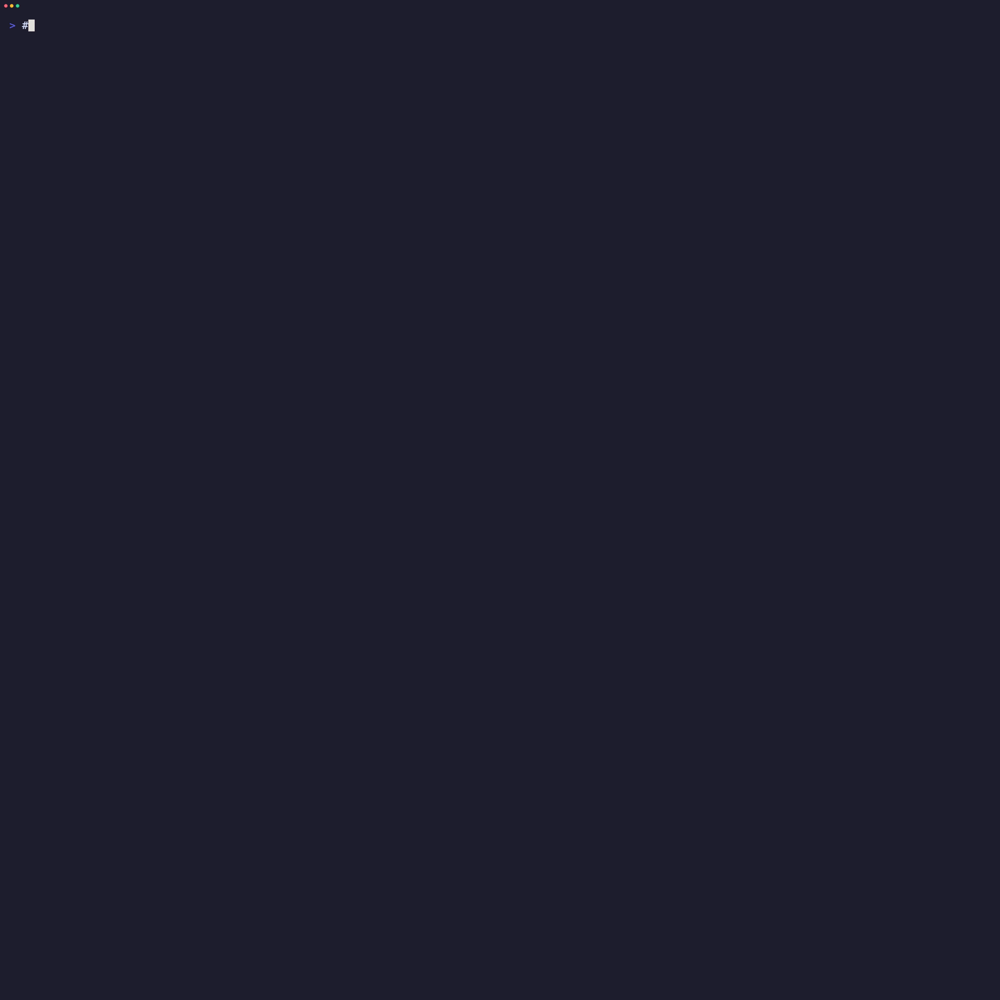

# 👀 peep — TLS diagnostics in plain English

[](https://github.com/thexsa/peep/releases/latest)
[](https://github.com/thexsa/peep/actions)
[](https://go.dev/)
[](LICENSE)
[](https://github.com/thexsa/peep/releases)
[](https://github.com/thexsa/homebrew-tap)

peep is a TLS diagnostic tool for support engineers, SREs, platform folks, and anyone who is tired of pretending hex dumps are a personality. It peeps into TLS handshakes & certificate chains, & tells you what's broken in plain English, instead of cryptographic cave paintings — because _"PKIX path building failed"_ was not helpful.

<!-- TODO: Add demo GIF here after recording with VHS -->
<!--  -->

```
$ peep self-signed.badssl.com
┃    Peeping at self-signed.badssl.com:443
┃    IP: 104.154.89.105
┃    Protocol: Direct TLS
┃    Direct TLS handshake completed successfully
┃
┃    ⚠ SERVER DID NOT INCLUDE THE ISSUING CA IN ITS RESPONSE
┃      One job. You had ONE job. Bundle the certs correctly. ONE. JOB.
┃
┃    Verdict: Appears to be Written in Crayon
┃    If this cert were a building, it would've been condemned.
┃
┃    Findings: 3 issue(s) detected
┃      [WARN] Self-Signed Certificate
┃      [FAIL] No Issuing CA in Server Response
┃      [FAIL] Chain Verification Failed
┃
┃    [PASS] TLS: TLSv1.2
┃    [PASS] Cipher: TLS_ECDHE_RSA_WITH_AES_128_GCM_SHA256
┃  CHAIN OF TRUST
┃
┃  [WARN] Leaf *.badssl.com
┃    Expires: 725 days (Apr 20, 2028)
┃    Covers: *.badssl.com, badssl.com
┃    Key: RSA
┃    Serial: EC7256235A58C012
┃    SHA-256: 3F2A:DC71:E756:...
┃    Self-signed!
┃
┃  [FAIL] No Issuing CA in server response
┃         The chain has exactly one link. That's not a chain. That's a pendant.
┃
┃  [FAIL] Trust store verification failed
┃         x509: certificate signed by unknown authority
┃         Trust store says no. Browsers say no. I say no. Everybody says no.
```

---

## Why peep?

Because `openssl s_client` was designed for cryptographers, not for the person at 2 AM trying to figure out why the load balancer is returning the wrong cert.

| The Problem | peep |
|-------------|------|
| `openssl s_client -connect host:443 -servername host < /dev/null 2>/dev/null \| openssl x509 -noout -text` | `peep host` |
| "PKIX path building failed" | "Missing intermediate cert — the server needs to send it" |
| "unable to get local issuer certificate" | "Chain verification failed — here's exactly which cert is wrong and why" |
| SMTP STARTTLS: add `-starttls smtp` and pray | `peep mail.company.com:587` |
| RDP certs: ❌ openssl can't even | `peep rdp-server:3389` just works |
| Manually checking OCSP, CRL, CT, ciphers separately | `peep scan host` checks everything in one shot |
| "It works in Chrome" (because Chrome does AIA chasing) | peep shows what `curl`, Go, Java, and Python actually see |
| Output designed for robots | Output designed for humans (with `--json` for the robots too) |
| No fix recommendations | `peep --explain host` tells you exactly what to do |

**Zero dependencies. Zero telemetry. Single binary. Runs locally.**

---

## Try These

After installing, try these against [badssl.com](https://badssl.com) to see peep in action:

```bash
# Self-signed cert — watch peep roast it
peep self-signed.badssl.com

# Expired cert — see exactly when it died
peep expired.badssl.com

# Wrong hostname — SNI mismatch
peep wrong.host.badssl.com

# Missing intermediate — the "works in Chrome but breaks everywhere else" problem
peep incomplete-chain.badssl.com

# Get explanations and fix recommendations for every finding
peep incomplete-chain.badssl.com --explain

# Full deep scan — ciphers, OCSP, CRL, CT logs, TLS version probing
peep scan google.com

# SMTP with STARTTLS
peep smtp.gmail.com:587

# See graduated examples for any command (simple → advanced → JSON + jq)
peep --examples
peep scan --examples
```

---

## Installation

### Homebrew (macOS / Linux)

```bash
brew install thexsa/tap/peep
```

### Quick Install (macOS / Linux)

```bash
curl -sSfL https://raw.githubusercontent.com/thexsa/peep/main/install.sh | sh
```

Detects your OS and architecture, downloads the latest release, verifies the SHA-256 checksum, and asks where you'd like to install.

### Go Install

```bash
go install github.com/thexsa/peep/cmd/peep@latest
```

Requires Go 1.23+.

### Download a Binary

Grab the latest binary for your platform from the [Releases](https://github.com/thexsa/peep/releases) page:

| Platform | Binary |
|----------|--------|
| macOS (Apple Silicon) | `peep-darwin-arm64` |
| macOS (Intel) | `peep-darwin-amd64` |
| Linux (x86_64) | `peep-linux-amd64` |
| Linux (ARM64) | `peep-linux-arm64` |
| Linux (ppc64le) | `peep-linux-ppc64le` |
| AIX (ppc64) | `peep-aix-ppc64` |
| Windows (x86_64) | `peep-windows-amd64.exe` |

```bash
# Download, make executable, add to PATH (example for macOS ARM)
curl -LO https://github.com/thexsa/peep/releases/latest/download/peep-darwin-arm64
chmod +x peep-darwin-arm64
sudo mv peep-darwin-arm64 /usr/local/bin/peep
```

**Windows:** Download `peep-windows-amd64.exe`, rename to `peep.exe`, and place in a directory in your `%PATH%`.

### Build from Source

Requires **Go 1.23+**. No CGO, no OpenSSL, no external dependencies.

```bash
git clone https://github.com/thexsa/peep.git
cd peep
make build       # Build for your platform → ./peep
make build-all   # Cross-compile all 7 platforms → dist/
```

---

## Features

### 🔍 Smart Protocol Detection
Just give peep a host and port. It figures out the rest.

| Port | Protocol | What peep does |
|------|----------|----------------|
| 443 | HTTPS | Direct TLS handshake |
| 587/25 | SMTP | STARTTLS upgrade |
| 3389 | RDP | X.224 negotiation → TLS _(where openssl fails!)_ |
| 636 | LDAPS | Direct TLS |
| 389 | LDAP | STARTTLS extended operation |
| 993/995 | IMAPS/POP3S | Direct TLS |
| 21 | FTP | AUTH TLS upgrade |

Override with `-P`/`--proto` when services run on non-standard ports:
```bash
peep -P smtp mailserver:2525
```

### 🔗 Chain of Trust Visualization
See exactly who signed what, whether the chain is complete, and what role each cert plays — with serial numbers and SHA-256 fingerprints.

### 📖 `--explain` Mode
Don't just show the problem — explain it, recommend a fix, and link to the relevant built-in docs:
```bash
$ peep --explain example.com

┃  [FAIL] No Issuing CA in Server Response
┃       The server did not include the issuing CA certificate ...
┃
┃       Why this matters:
┃       During the TLS handshake, the server is expected to send the
┃       complete certificate chain ...
┃
┃       Recommended fix:
┃       Add the issuing CA (intermediate) certificate to the server's
┃       cert chain. Concatenate them: cat leaf.crt intermediate.crt > fullchain.crt ...
┃
┃       📖 Learn more:  peep docs chain
```

### 📚 Built-in TLS Reference
Learn TLS concepts without leaving the terminal:
```bash
peep docs                  # Table of contents
peep docs tls              # What is TLS?
peep docs certs            # Leaf vs Intermediate vs Root
peep docs chain            # How chain of trust works
peep docs ciphers          # Cipher suites explained
peep docs crl              # Certificate Revocation Lists
peep docs ocsp             # OCSP — stapled vs live, Must-Staple
peep docs aia              # AIA chasing & "works in Chrome" gotcha
peep docs tls-handshake    # TLS 1.2 vs 1.3 handshake flows
peep docs starttls         # What STARTTLS is
peep docs rdp              # Why RDP certs are special
peep docs troubleshooting  # Common issues checklist
```

### 📊 JSON Output
Pipe to `jq`, feed into monitoring, or parse in CI/CD:
```bash
peep --json example.com | jq '.overall_status'
peep --json --explain example.com | jq '.warnings[].fix'
```

### 💡 Contextual Examples (`--examples`)
Not sure how to use a command? Add `--examples` to any command for graduated usage examples — from simple to advanced — always ending with JSON + `jq` extraction queries:
```bash
peep --examples               # Examples for the root command
peep scan --examples           # Examples for deep scans
peep docs --examples           # Examples for the docs browser
peep update --examples         # Examples for self-update
```

### 🔒 CRL & Revocation Intelligence
The deep scan checks CRL revocation by fetching the Certificate Revocation List and verifying the certificate serial is not present.

**LDAP distribution points** (common with Microsoft AD CS) are automatically detected and skipped — peep will try HTTP endpoints instead and provide the `ldapsearch` command for manual verification from a domain-joined machine.

**TLS endpoint warnings**: If the CRL endpoint has a certificate error (e.g., hostname mismatch), peep still fetches and verifies the CRL data (it's signed by the CA, so transport-layer TLS isn't required for integrity), but warns you.

### 🌶️ Sarcastic Commentary
Every finding comes with rotating sarcastic remarks. Because debugging TLS should at least be entertaining.

### 🔄 Self-Update
peep checks for updates automatically (once every 24 hours) and notifies you after scan output:
```
  💡 Update available: v1.3.0 → v1.4.0 (run `peep update` to upgrade)
```

Update with a single command — peep auto-detects whether you installed via Homebrew or GitHub binary:
```bash
peep update              # Update to latest
peep update --check      # Just check, don't install
```

Disable automatic checks: set `PEEP_NO_UPDATE_CHECK=1` in your environment.

---

## Usage

```bash
# Quick check (defaults to port 443)
peep example.com

# Specific port (always host:port format)
peep example.com:8443

# Detailed cert info cards (subject, issuer, key info, SANs, etc.)
peep -d example.com

# Base64 PEM encoded certs
peep -v example.com

# Raw x509 text output (like openssl x509 -text)
peep -r example.com

# Explain every issue with fixes and doc references
peep -e example.com

# JSON output (for scripting / CI/CD)
peep -j example.com
peep -j -e -v example.com

# Save all cert PEMs to files
peep --save example.com

# Save a specific cert by chain index (0=leaf, 1=intermediate, etc.)
peep --save=0 example.com

# SMTP (auto-detects STARTTLS)
peep mail.example.com:587

# RDP (handles X.224 negotiation)
peep rdp-server.example.com:3389

# Force protocol on non-standard port
peep -P smtp mailrelay.internal:2525

# Plain text output (no color, no emoji — easy to copy/paste)
peep -p example.com

# Deep scan (cipher enumeration, OCSP staple + live, CRL, CT logs, SSL/TLS version probing)
peep scan example.com

# Deep scan with explanations and remediation advice
peep scan --explain example.com

# Skip trust store verification (for self-signed certs)
peep -i internal-server.local:443

# Built-in docs
peep docs certs

# Check for updates
peep update --check

# Update to latest version
peep update

# Contextual examples for any command
peep --examples
peep scan --examples
peep docs --examples
```

### All Flags

Every flag has a standard name and a fun themed alias. Use whichever speaks to you.

| Short | Flag | Themed Alias | Description |
|-------|------|-------------|-------------|
| `-d` | `--details` | `--gaze` | Show detailed cert info cards |
| `-e` | `--explain` | `--whytho` | Explain each issue with fix recommendations and doc references |
| `-h` | `--help` | | Show help |
| `-i` | `--insecure` | `--blindfold` | Skip system trust store verification |
| `-j` | `--json` | | JSON output for scripting (respects -d, -v, -e) |
| `-p` | `--plain-text` | `--shades` | No color, no emoji, no Unicode — easy to copy/paste |
| `-P` | `--proto` | `--lens` | Force protocol: `tls`, `smtp`, `rdp`, `ldap`, `ftp` |
| `-r` | `--raw` | | Raw x509 text output for each cert (like `openssl x509 -text`) |
| `-s` | `--save` | `--polaroid` | Save cert PEM(s) to files. No value = all, or specify index |
| `-t` | `--timeout` | `--blink` | Connection timeout in seconds (default: 5) |
| `-v` | `--verbose` | `--stare` | Show base64 PEM encoded certs |
| | `--examples` | `--show-me` | Show contextual usage examples with jq queries |
| | `--internal-ca` | | Adjust grading for internal/private CA certs (skips SCT and 398-day checks) |
| | `--ca-bundle` | | Path to CA certificate bundle (.pem, .crt, .cer, .der) — replaces system trust store |

#### Subcommands

| Command | Description |
|---------|-------------|
| `peep scan <host>` | Deep scan with cipher enumeration, OCSP, CRL, CT logs |
| `peep docs [topic]` | Built-in TLS reference |
| `peep update` | Update peep to the latest version (alias: `peep upgrade`) |
| `peep update --check` | Check for updates without installing (alias: `--sniff`) |
| `peep update --force` | Force update even if already on latest version |
| `peep version` | Show version, install method, and platform |
| `peep completion --install` | Install shell tab-completion (zsh, bash, fish, PowerShell) |

### Flag Combinations
Flags work in any order and combine freely:
```bash
peep -j -e -v example.com              # Full JSON with explanations and PEM certs
peep -d -j example.com                 # JSON with detailed cert info
peep --whytho example.com              # CLI with issue explanations (themed alias)
peep --shades --whytho example.com     # Copy/paste friendly with explanations
peep --polaroid example.com            # Save all cert PEMs (themed alias)
peep --ogle example.com                # Raw x509 output (themed alias)
```

---

## Internal/Private CA Support

When scanning certificates signed by internal or private CAs (like Microsoft AD CS), peep automatically detects private CA characteristics using a confidence scoring system. In standard mode, it shows a **CA Origin Assessment** block with evidence when a non-public CA is suspected.

### `--internal-ca`

Explicitly tell peep the certificate is from an internal CA. This adjusts grading:
- **SCT warnings** are suppressed (internal CAs don't participate in Certificate Transparency)
- **398-day validity warnings** are skipped (internal CAs commonly issue longer-lived certs)
- The CA origin assessment block is hidden

```bash
# Scan an internal server — skip public-CA-only checks
peep scan intranet.corp.local --internal-ca

# Combine with --insecure if the root CA isn't in your system store
peep scan intranet.corp.local --internal-ca --insecure
```

### `--ca-bundle`

Replace the system trust store with a custom CA certificate bundle. Works like `curl --cacert` — the specified file becomes the **only** trusted root(s).

Supports `.pem`, `.crt`, `.cer` (PEM-encoded) and `.der` (DER-encoded) files.

```bash
# Verify against your organization's root CA
peep scan mail.corp.local --ca-bundle /path/to/corp-root-ca.pem

# Combine with --internal-ca for proper grading
peep scan mail.corp.local --ca-bundle /path/to/corp-root-ca.crt --internal-ca
```

---

## Privacy & Telemetry

**peep does not collect telemetry, analytics, or usage data.**

The only outbound network requests peep makes are:

1. **TLS connections** to the host you're scanning (that's the whole point)
2. **OCSP/CRL checks** to the CA's responder (in `scan` mode only, to verify revocation status)
3. **Update checks** to the GitHub Releases API (once every 24 hours, disabled with `PEEP_NO_UPDATE_CHECK=1`)

No hostnames, certificates, scan results, or any other data is sent anywhere. Ever. peep is a local tool that runs on your machine and talks only to the hosts you point it at.

---

## Shell Autocompletion

peep supports tab-completion for bash, zsh, fish, and PowerShell. This is optional — peep works fine without it.

Autocompletion lets you tab-complete commands and flags:
```
peep do<TAB>     →  peep docs
peep --ex<TAB>   →  peep --explain
```

#### Auto-Install (recommended)

One command — peep detects your shell and sets everything up:
```bash
peep completion --install
```

This will:
- Detect your current shell (zsh, bash, fish, or PowerShell)
- Write the completion script to `~/.peep/completions/`
- Append the necessary source line to your shell's rc file (`.zshrc`, `.bashrc`, etc.)
- **Never overwrite** — only appends if not already present
- Running it again is safe (idempotent)

You can also specify the shell explicitly:
```bash
peep completion zsh --install
peep completion bash --install
peep completion fish --install
peep completion powershell --install
```

**Windows / PowerShell:** `peep completion --install` appends to your `$PROFILE`. If you get an execution policy error, run:
```powershell
Set-ExecutionPolicy RemoteSigned -Scope CurrentUser
```

#### Manual Setup (alternative)

If you prefer to manage it yourself, generate the script to stdout:
```bash
peep completion zsh          # print to stdout
peep completion bash         # print to stdout
peep completion fish         # print to stdout
peep completion powershell   # print to stdout
```

> **Note:** Autocompletion requires `peep` to be in your `$PATH` (not just `./peep`). See the [Installation](#installation) section.

---

## Why Not Just Use OpenSSL?

| Task | openssl | peep |
|------|---------|------|
| Check a cert | `openssl s_client -connect host:443 -servername host < /dev/null 2>/dev/null \| openssl x509 -noout -dates` | `peep host` |
| Check SMTP cert | `openssl s_client -connect host:587 -starttls smtp` | `peep host:587` |
| Check RDP cert | ❌ _Can't_ | `peep host:3389` |
| See the chain | `openssl s_client -connect host:443 -showcerts` | `peep host` |
| Understand what's wrong | _Read the hex and figure it out_ | _peep tells you in English_ |
| Get fix recommendations | ❌ _Nope_ | `peep --explain host` |
| JSON for CI/CD | _Roll your own parser_ | `peep --json host` |

---

## Technical Details

- **100% Go** — no CGO, no OpenSSL, no external runtime dependencies
- **Single binary** — download and run, nothing to install
- **Cross-platform** — macOS (ARM + Intel), Linux (amd64, arm64, ppc64le), AIX (ppc64), Windows (amd64)
- **CLI framework** — [spf13/cobra](https://github.com/spf13/cobra) (Apache 2.0)
- **Terminal styling** — [charmbracelet/lipgloss](https://github.com/charmbracelet/lipgloss) (MIT)
- **Terminal width** — [golang.org/x/term](https://pkg.go.dev/golang.org/x/term) (BSD-3-Clause)

---

## Contributing

Contributions are welcome! See [CONTRIBUTING.md](CONTRIBUTING.md) for development setup, project structure, and PR guidelines.

Please read our [Code of Conduct](CODE_OF_CONDUCT.md) before contributing.

---

## License

Apache 2.0 — see [LICENSE](LICENSE) for the full text.

---

_Built with Go — no OpenSSL required._
